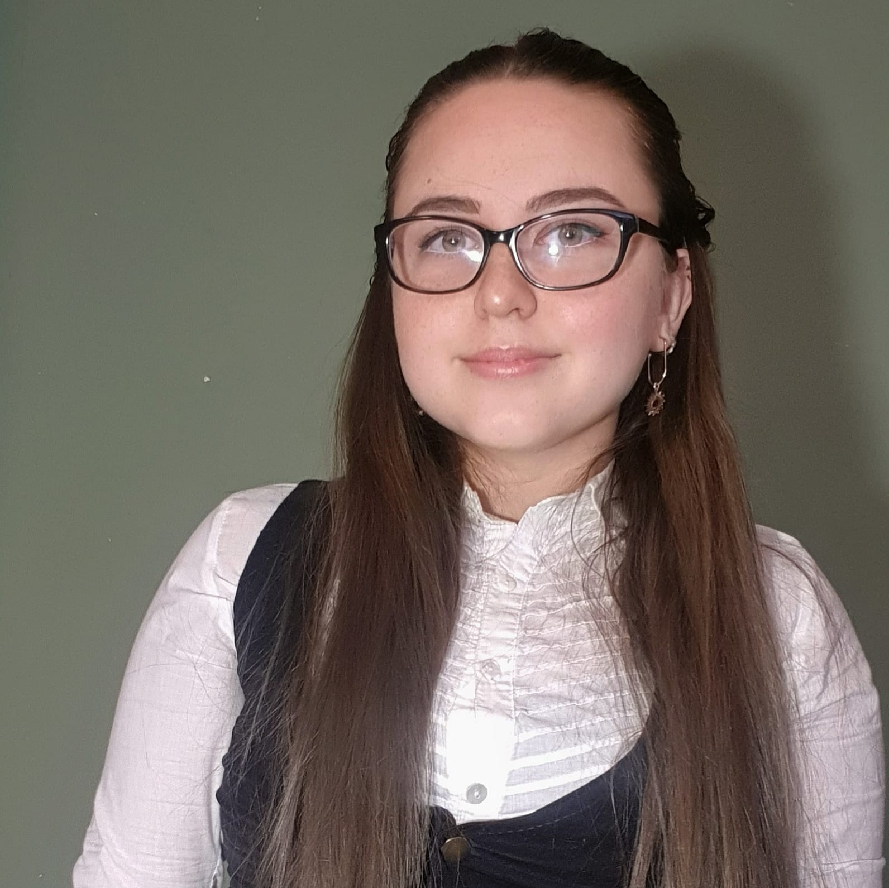

```{r setup, include=FALSE}
knitr::opts_chunk$set(echo = TRUE)
  comment=NA
  warning = FALSE
  message =FALSE
```

<center>
{width=50%}
</center>

# Goals for this Website
- Present my CV to future employers
- Present and organize previous work in portfolio style 
- Facilitate collaboration  
- Practice Data Science and Coding skills 

# Education

## College 
- Macalester College, St. Paul MN. U.S                  
- GPA: 3.91 Summa Cum Laude                  
- Bachelor of Arts May 2022    

#### Majors: 
International Studies and Political Science. 

#### Minor:
Data Science: Political Analytics

#### Concentrations:
Human Rights and Humanitarianism and International Development. 

#### Honors: 
Theodore Mitau Grant Recipient Summer 2021. Kofi Annan scholarship awarded for history of academic and personal excellence. Davis Scholarship awarded to successful graduates from United World College to perpetuate the diversity mission in institutions for higher education. Dean’s list Fall 2018, Spring 2019, Fall 2019. Spring 2020, Fall 2020.

#### Coursework: 

Intro to Data Science, Empirical Research Methods, Statistical Modelling, Political Economy of Development, Core Concepts of Computer Science, Advanced Data Science, Econometrics.

## Highschool 

- United World College, Changshu China    
- International Baccalaureate (IB) Bilingual Diploma completed June 2018 
- Scholarship granted by the Argentine National Committee to attend UWC for 2 years along with peers from 100+ countries. 


#  Relevant Experiences:

__Consultant, C4ADS. Washington D.C.    October 2022-Present__

State-sponsored Threats Team

•	Support the North Korea and China portfolios collecting and structuring data regarding international networks involved in sanction evasion.
•	Identify vessels involved in oil smuggling from North Korea with the use of geo-spatial tools and satellite software to build a robust database for the company. 
•	Write analytical products to summarize findings from open-source investigation in Mandarin and English on entities suspected of illicit activity. 

__Analyst Inter, C4ADS. Washington D.C. June 2022-August 2022__

Human Security Team 

•	Conducted data foraging, collection and detailed analysis to find evidence for investigation on transnational illicit networks emphasizing the role of China. 
•	Utilized a wide range of softwares for data analysis and visualization as well as geo-special tools to enhance investigation.
•	Produced a range of analytical products from public reports to private dossiers for a wide audience, including law enforcement, regulatory agencies, and multinational organizations.

  
__Precept Intro to Data Science course Macalester College, St. Paul, MN  December 2021-May 2022.__

•	Assisted the faculty of the department with planning lectures and assisting to the class sessions. 
•	Supported a cohort of 60 students by holding regular group tutoring sessions as well as one-on-one sessions. 
•	Graded daily activities and exams to facilitate student’s improvement with frequent feedback.

__Preceptor, Macalester College. June 2021-December 2021.__

  Precept First-year course Latin America Through Women’s Eyes.
  
  - Review and update the historic syllabus to adapt to new events, perspectives and needs form the 2021 cohort. 
  - Consolidate the logistics and preparations for guest speakers, group events and daily class sessions.
  - Support students individually during office hours to aid in writing process, adaptation and general concerns.

__Research Assistant, University of Michigan. Remote. June 2021-August 2021.__

  Research on Cognitive Psychology and Effects of the Pandemic on Education.
  
  -	Investigate and review articles and academic sources relevant to the topic. 
  -	Condense meaningful concepts and ideas from academic sources and translate it into 1Cademy platform.
  -	Present finding in a compelling and engaging way with the team during weekly meetings.                                          

__Research Assistant, Minneapolis MN. U.S  January 2019-December 2020.__

  Research on African Party Activism for Professor Mueller’s book.    
  
  -	Organize and translate large literature review into original research project.
  -	Review legal documentation and create a data base for further analysis.
  -	Compile bi-weekly briefs on research progress for Professor Mueller.

__The Advocates for Human Rights, Minneapolis MN. U.S. December 2019-January 2020.__

  Intern at the Refugee and Immigration Program.
  
  - Answer the client phone hotline, provide referrals and communicate with current clients.
  -	Conduct phone intakes for potential asylum clients and post intake interviews.
  -	Write case summaries, and research on legal and human rights conditions on countries for evidence.

__Qatar Foundation World Innovation Summit for Education, Doha, Qatar. November 2019__

  Fellow of Learner’s Voice Program. 
  
  -	The WISE Learners’ Voice Program brings the views of students to the issue of rethinking education and prepares them to take on leading roles in their fields and in the world of education participating in the annual WISE Summit in Doha. 

__International Relations Secretariat of Salta, Argentina. July 2017__

  Intern and Personal Assistant.
  
  -	Staff the Secretariat in important meetings or attended to them on his behalf.
  -	Plan and schedule agendas for long term projects.
  -	Organize meetings with NGOs and civil society associations.


# Additional Work Experience:

__Spanish and Portuguese Department. Macalester College. Fall 2018-Present__

  Spanish Lab Assistant and Tutor.
  
  -	Prepare, teach and grade the weekly lab activities. 
  -	Assist and develop rapport with students to encourage active participation in lab activities. 

__Residential Life Department. Macalester College__ 

  Residence Assistant  January 2019 & 2020.
  
  -	Conduct rounds on campus, delivering a fast response on critical situations and provide direct communication between the students and the Residence Hall Director.
  -	Implement community building dynamics focused on the students’ diversity.

# Skills:

__Languages__:  

- English and Spanish: Fully fluent. 
- French: Excellent level in reading, writing and speaking. 
- Mandarin: Basic understanding, mastered 1000 characters. 
- Latin: Knowledge sufficient to perform translations and for legal studies. 

__Computer__:
Microsoft and Google suite. Photo Shop and Movie Maker. R Studio for Data Science. Python. LaTeX software. QGIS. Tableau. Maxar. Sentinel Hub. Airbus.

# Extra-curricular: 

- Comunidades Latinas Unidas en Servicio (CLUES) Volunteer Spring - 2020-May 22.
- Instructor of Weight Lifting for Women of Color - Fall 2019-May 2022. 
- Model United Nation - 2016-May 2022.
- UWC Argentina National Committee Volunteer - 2016-Present.

# Contact 

Email me at mtorresj@macalester.edu 


